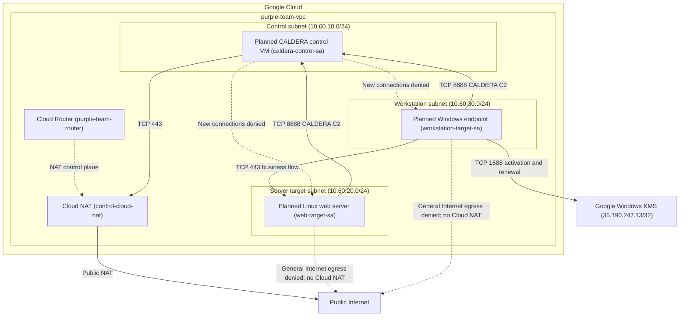

# Network Topology

This document shows the current network segmentation and intended traffic flows
for the automated purple-team lab.

The lab uses a single custom VPC divided into separate trust zones for the
control workload, Linux server target, and Windows workstation target.

The Compute Engine workloads shown below are planned. The VPC, subnets, Cloud
NAT, workload identities, and firewall policy are already defined separately
from the future VM deployment.

## Topology

## Current trust rules

### Control zone

The control subnet is `10.60.10.0/24`.

The planned CALDERA workload uses the `caldera-control-sa` service account.

The control subnet is the only lab subnet currently included in Cloud NAT.
The CALDERA workload is allowed outbound TCP 443 for provisioning, updates,
and required dependencies.

Other CALDERA egress is denied unless a higher-priority firewall rule
explicitly permits it.

New connections initiated by CALDERA toward either target subnet are denied.

### Server target zone

The server target subnet is `10.60.20.0/24`.

The planned Linux web-server workload uses the `web-target-sa` service
account.

The Linux target may initiate CALDERA C2 traffic to the control workload on
TCP 8888.

It may receive the defined business HTTPS flow from the Windows workstation
on TCP 443.

The server target subnet is not included in Cloud NAT, and general Internet
egress from the server target workload is denied.

### Workstation zone

The workstation subnet is `10.60.30.0/24`.

The planned Windows endpoint uses the `workstation-target-sa` service account.

The Windows endpoint may initiate CALDERA C2 traffic to the control workload
on TCP 8888.

It may also initiate the representative business workflow to the Linux web
server on TCP 443.

General Internet egress from the workstation workload is denied.

The workstation subnet has Private Google Access enabled.

### Windows activation exception

The Windows workstation has a narrowly scoped egress exception for Google
Windows KMS.

The exception permits only TCP 1688 to the configured Google Windows KMS
IPv4 destination.

This rule exists for Windows activation and renewal and does not provide
general Internet access to the workstation.

## Traffic summary

Permitted application flows:

- Linux web target to CALDERA: TCP 8888
- Windows workstation to CALDERA: TCP 8888
- Windows workstation to Linux web server: TCP 443
- CALDERA to the Internet through Cloud NAT: TCP 443
- Windows workstation to Google Windows KMS: TCP 1688

Restricted flows include:

- CALDERA-initiated connections toward the Linux target
- CALDERA-initiated connections toward the Windows target
- General Internet egress from the Linux target
- General Internet egress from the Windows workstation

## Diagram conventions

Solid arrows represent explicitly permitted traffic paths.

Dotted arrows represent denied traffic or infrastructure relationships that
are not normal application traffic.

Firewall rules use workload service accounts where appropriate so that policy
is tied to workload identity in addition to network location.
