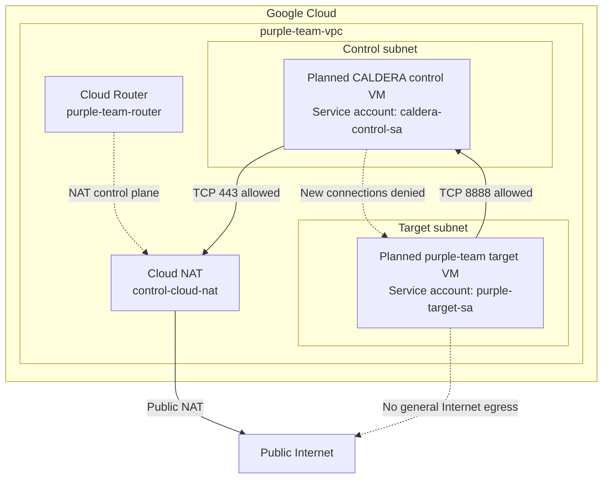

# Network Topology

This diagram represents the current network design and the planned placement of
the CALDERA control and purple-team target workloads.

The workload nodes are marked as planned because the Compute Engine instances
have not been created yet.

## Current trust rules

- The target can initiate CALDERA C2 traffic on TCP 8888.
- Other target-to-control traffic is denied.
- CALDERA may not initiate new connections into the target subnet.
- CALDERA may initiate outbound HTTPS connections on TCP 443.
- Other CALDERA egress is denied.
- The control subnet is included in Cloud NAT.
- The target subnet is not included in Cloud NAT.
- Neither workload will receive a public VM address.
