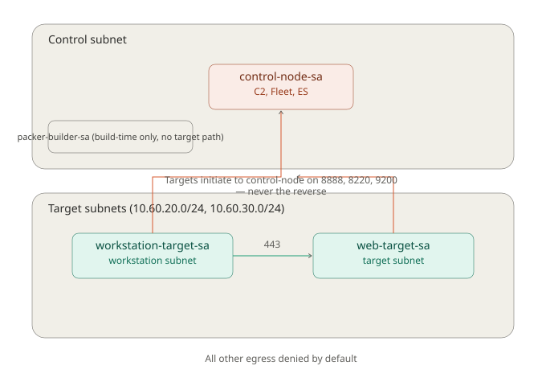

# Firewall Trust Model

The project separates control-side workloads from target (web abd workstation)  workloads and
allows communication only when required.

The initial firewall policy is built around 2 workload identities:

- `control-node-sa` for the CALDERA/Elastic/Fleet control workload (renamed
  from `caldera-control-sa` once this workload grew to host CALDERA,
  Elasticsearch, Kibana, and Fleet Server together as containers, rather
  than a single dedicated CALDERA VM)
- `web-target-sa, workstation-target-sa` for target systems that emulate business workloads

A third identity, `packer-builder-sa`, is also a firewall selector: it is
the runtime identity attached to temporary Packer image builders (Windows
workstation, Ubuntu workstation, CALDERA VM (archived), and control-node),
not a permanent lab workload. See `08-packer-image-pipeline.md`.

These service accounts are attached to planned Compute Engine workloads and are
used as firewall selectors. They are not used by the workloads to log into one
another.

The service accounts do not have user-managed service account keys.

In general, I try to make a good linear logic flow, so that it wasy to follow up the priority. 
I prioritize the legable flow here as it helps add/ restrict further workload actions later.
If there is a benefit to combining objects (ip ranges + workload identities), i will figure it
out later. 

## Network zones

The control subnet is:

    10.60.10.0/24

The target subnet is:

    10.60.20.0/24

The control and target networks are intentionally treated as separate trust
zones even though they are part of the same VPC.

## CALDERA communication

The initial CALDERA communication model allows a vm in target workloads to initiate
a connection to the CALDERA control workload on TCP port 8888.

The intended flow is:

    web-target-sa, workstation-target-sa
            |
            | TCP 8888
            v
    control-node-sa

The target initiates the connection.

Traffic leaving the target is egress from the target workload. The same traffic
arriving at CALDERA is ingress to the control node workload.

## Firewall rules

### allow-target-to-caldera-c2

Direction: ingress

This rule allows TCP port 8888 into workloads using `control-node-sa` when
the traffic originates from a workload using `web-target-sa, workstation-target-sa`.

The service accounts identify the workloads participating in the connection.

### allow-target-to-caldera-c2-egress

Direction: egress

This rule allows workloads using `web-target-sa, workstation-target-sa` to send TCP port 8888
traffic toward the control subnet.

It has priority 1000 so this specific exception is evaluated before the broader
target-to-control deny rule.

### deny-target-to-control

Direction: egress

This rule denies other traffic from workloads using `web-target-sa, workstation-target-sa` toward
the control subnet.

It has priority 2000.

The result is:

    target -> control TCP 8888        allow
    target -> control other traffic   deny

Future required traffic will receive its own specific rule rather than
modifying this exception. this will help organize the rules (good linear logic flow).

### deny-caldera-to-target

Direction: egress

This rule prevents workloads using `control-node-sa` from initiating
arbitrary new connections toward the target subnet.

Replies belonging to an already established target-initiated connection are
handled by the stateful VPC firewall memory.

If a future simulation requires the control node to initiate a specific connection to a
target, the port/protocal will be addaded as a separate allow rule (again for good linear flow).

### allow-iap-to-packer-winrm / allow-iap-to-packer-ssh

Direction: ingress

These allow Google's IAP TCP-forwarding range (`35.235.240.0/20`) to reach
`packer-builder-sa` on WinRM (5986, for the Windows workstation build) or
SSH (22, for the Ubuntu workstation, CALDERA VM, and control-node builds).
Temporary Packer builder VMs have no external IP; this is the only path in
to them.

### allow-packer-http-egress / allow-packer-https-egress

Direction: egress

Temporary Packer builders need outbound HTTP (80) and HTTPS (443) to reach
OS package mirrors and third-party build dependencies (Microsoft, Node,
Go, Docker, Elastic, GitHub). Destination is `0.0.0.0/0` since these
dependencies span multiple hosts not fixed in advance.

### allow-iap-to-control-node-ssh / allow-iap-to-control-node-ui

Direction: ingress

Same IAP pattern as the Packer builder rules, but for admin access to the
persistent control-node instance rather than a temporary builder: SSH (22)
and the control-plane web UIs (8888 CALDERA, 5601 Kibana, 9200
Elasticsearch).

### allow-control-node-http-egress / allow-control-node-https-egress

Direction: egress

control-node-sa needed its own HTTP/HTTPS egress rules, separate from
packer-builder-sa's -- the containerized CALDERA image now gets built on
the real running instance itself (via the self-deploying
`purple-lab-deploy.sh`), not only inside a temporary Packer builder. Same
destinations as the Packer rules (apt mirrors on 80, NodeSource/Docker/Go/
GitHub/Elastic on 443).

### deny-control-node-other-egress

Direction: egress

Same purpose as `deny-target-to-control`: closes off everything
control-node-sa is not explicitly allowed, once the actual allow rules
above were confirmed sufficient for a real working deploy.

## Firewall logging

Logging is enabled for the initial firewall rules.

firewall metadata is currently excluded to reduce log volume.
Logging settings can be revisited when network telemetry is integrated
with the monitoring and detection portions of the lab.

## IAM boundary

Terraform manages firewall rules by impersonating the dedicated
`terraform-deployer` service account.

A project-level custom role named `terraformFirewallManager` provides the
firewall management permissions needed by Terraform instead of granting the
broader Compute Security Admin role.

The custom role contains firewall create, read, list, update, and delete
permissions.

Terraform also has Service Account User permission directly on
`control-node-sa` and `web-target-sa, workstation-target-sa`. These grants are scoped to the
individual workload service accounts rather than the entire project.

The workload service accounts themselves currently have no project-level IAM
roles.

## Current limitations

CALDERA (containerized) and control-node are running as real Compute Engine
workloads as of the sessions covering `08-packer-image-pipeline.md` and the
control-node self-deploy work. web-target-sa and workstation-target-sa
still have no Compute Engine workloads attached.

The current firewall policy also does not allow:

- public SSH or RDP
- public CALDERA access
- Fleet Server enrollment from outside control-node's own Docker network
  (Fleet Server itself runs locally-tested only so far, not yet deployed
  to control-node)
- administrative management paths beyond IAP

Those will be allowed when the resource or function is necessary.
