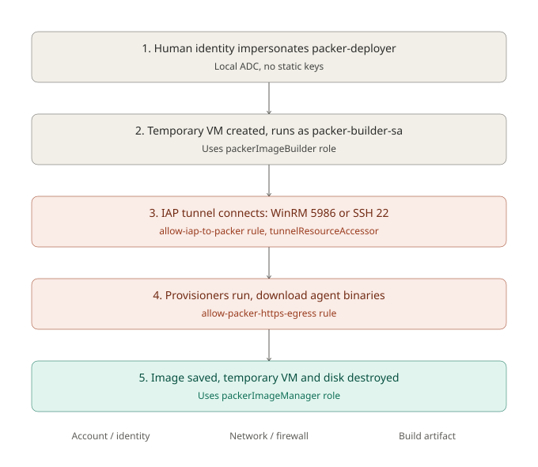

# Packer Image Pipeline

Packer builds the golden images used for workload targets. This covers both
the Windows and Ubuntu workstation builds, since they share the same
lifecycle and the same account/network model.

## Why golden images

A VM built from a pre-baked image boots ready to use, instead of needing
software installed and configured every time it starts. This matters for two
reasons in this lab: cost (less boot-time compute per ephemeral session) and
consistency (every target instance from the same image is identical, which
matters for later comparing attack results against a known baseline).

## The five stages

### 1. Identity

Local ADC impersonates a dedicated `packer-deployer` service account, same
pattern as Terraform's `terraform-deployer`. No static keys.

### 2. Temporary builder VM

`packer-deployer` creates a short-lived VM using the `packerImageBuilder`
custom role (instance create/delete, disk create/delete, serial port read,
metadata/service-account assignment). The VM itself runs as
`packer-builder-sa`, a separate, narrower identity from `packer-deployer`.

### 3. Connecting to the builder

Since the VM has no external IP, Packer reaches it through an IAP tunnel:

- Windows uses WinRM over HTTPS, port 5986
- Ubuntu uses SSH, port 22

Both need two things to succeed, not one: a firewall rule
(`allow-iap-to-packer-winrm` / `allow-iap-to-packer-ssh`) permitting IAP's
TCP-forwarding range to reach that port on `packer-builder-sa`, and
`roles/iap.tunnelResourceAccessor` granted to whichever identity is actually
opening the tunnel. This second part isn't automatic just because
`packer-deployer` is impersonated for resource creation -- the IAP tunnel
step can fall back to the local human identity instead. Both
`packer-deployer` and my own account need this role, each scoped by
condition to the specific port their builds use. See
[07-troubleshooting-log.md](./07-troubleshooting-log.md) for how this was
found.

### 4. Provisioning

Once connected, Packer runs the provisioners defined in the build file:

- a smoke test (confirms the connection and prints basic OS info)
- an Elastic Agent install (binary only, pinned to a specific version, not
  enrolled -- enrollment needs a Fleet URL and token specific to a running
  instance, so it happens later at boot time, not at image-build time)

Anything the provisioners download over the internet (e.g. the Elastic Agent
archive) depends on `allow-packer-https-egress`, which permits outbound 443
from `packer-builder-sa` to any destination. This is intentionally broad
since build-time dependencies can come from multiple third-party hosts whose
addresses aren't fixed in advance.

### 5. Image creation and cleanup

Once provisioning succeeds, Packer saves a custom image and then deletes the
temporary VM and disk. Saving the image needs the `packerImageManager`
custom role on `packer-deployer` -- separate from `packerImageBuilder`,
since managing the resulting artifact is a different concern from managing
the temporary build infrastructure. `packerImageManager` includes
`compute.images.deprecate`, which Packer calls automatically on every build
(even the first one) to deprecate the previous image in the family --
missing this permission is what caused the first real build to fail after
the image had already been created.

## Windows vs. Ubuntu, what's actually different

The account and network model above is identical for both. What differs is
entirely inside the provisioning step itself:

|                          | Windows                              | Ubuntu                        |
|--------------------------|---------------------------------------|--------------------------------|
| Communicator             | WinRM over HTTPS (5986)              | SSH (22)                      |
| First-boot wait          | Sysprep specialize pass, several minutes | Cloud-init, ready in seconds |
| Bootstrap mechanism      | `sysprep-specialize-script-ps1` metadata runs `bootstrap-winrm.ps1` to stand up the WinRM listener | None needed -- SSH is ready almost immediately |
| Provisioner scripting    | PowerShell                           | shell (bash)                  |

The Ubuntu build is meaningfully faster and simpler to debug for exactly
this reason -- there's no sysprep-equivalent wait, and SSH over IAP has
fewer moving parts than WinRM over IAP.

## Skip-image builds

Both `variables.pkr.hcl` files expose `skip_create_image`. Set to `true`,
Packer runs the full lifecycle above except the final image save -- useful
for validating a change to the pipeline (new provisioner, firewall change,
IAM change) without producing and paying to store an image artifact each
time.
